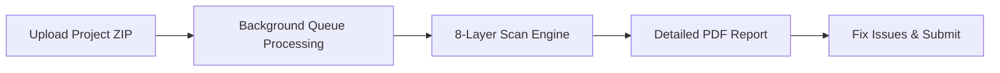

# 🚀 CodeAudit Pro - The Ultimate Multi-Platform Code Audit Solution

[](https://php.net)
[](https://laravel.com)
[](mailto:aboutsystem2@gmail.com)

**CodeAudit Pro** is a comprehensive, multi-platform code auditing solution that automatically scans your projects against Envato requirements and global coding standards. Save hours of manual review and ensure first-time acceptance.

---

## 📋 **Quick Overview**

✅ **Multi-Platform Support** – Laravel • WordPress Themes • WordPress Plugins • Flutter • React  
✅ **8 Comprehensive Scan Types** – Security • Quality • Architecture • Localization • Database • JavaScript • Assets • Envato Requirements  
✅ **PDF Reports** – Professional reports with exact file + line number  
✅ **SaaS Ready** – Complete subscription system with Stripe integration  
✅ **Self-Hostable** – Full source code included  
✅ **RTL Support** – Full Arabic language support  
✅ **Dark/Light Mode** – Modern, accessible interface

---

## 🔍 **Supported Platforms (Full Coverage)**

### **🟣 Laravel Applications**
Full Laravel ecosystem scanning:
- Controllers, Models, Services, Policies
- Blade templates & Localization
- Migrations & Database queries
- Route files & Middleware

### **🔵 WordPress Themes** (ThemeForest Ready)
Complete theme validation:
- `style.css` header verification (Theme Name, Author, Version, License)
- Required template files check
- WordPress hooks compliance (`wp_head()`, `wp_footer()`, etc.)
- Security & escaping functions

### **🔵 WordPress Plugins** (WordPress.org Ready)
Professional plugin auditing:
- Plugin file header validation
- `readme.txt` structure & required sections
- Prefixing to prevent function collisions
- Nonce verification & sanitization
- Database query safety (`$wpdb->prepare()`)

### **🟢 Flutter SDK**
Dart & Flutter project analysis:
- `pubspec.yaml` validation (SDK version, null safety)
- Hardcoded string detection for localization
- Unused imports & large file warnings
- `const` constructor optimization
- BuildContext verification

### **⚛️ React / JavaScript**
Modern JS framework scanning:
- `package.json` security audit (vulnerable libraries)
- PropTypes / TypeScript interface validation
- React Hooks rules (useEffect dependencies, conditional hooks)
- Performance optimization (component size, useCallback)
- Environment variable exposure checks

---

## 📊 **8 Scan Layers (What We Detect)**

| Scan Layer | Detection Capabilities |
|------------|----------------------|
| **Security** | XSS, CSRF, SQL Injection, eval(), exec(), shell_exec(), system() |
| **Envato Requirements** | External CDN, missing README, prohibited code patterns |
| **Code Quality** | PSR-12, camelCase, FQCN, duplicate code, dead code |
| **Architecture** | Controller size (>250 lines), missing Policies, business logic in Controllers |
| **Localization** | Untranslated text, placeholder attributes, full RTL support |
| **Database** | Foreign keys without constrained(), raw SQL, InnoDB engine |
| **JavaScript** | console.log, eval(), innerHTML, dangerouslySetInnerHTML, native alerts |
| **Assets** | External CDN, missing Alt tags, unnecessary files, inline styles |

---

## 🛠️ **How It Works**



1. **Upload** your project (ZIP file)
2. **Background processing** – no waiting, queue system handles large projects
3. **8-layer scan** against Envato + global standards
4. **Detailed PDF report** with exact file names and line numbers
5. **Fix and submit** with 100% confidence

---

## 💼 **Business Opportunity**

CodeAudit Pro isn't just a scanner – it's a **complete SaaS platform** ready for you to:

### **💰 Generate Revenue**
- Sell monthly subscriptions ($9.99 - $19.99)
- Offer team packages for agencies
- White-label for your clients
- One-time license sales

### **📈 Scale Your Business**
- Built-in Stripe payment integration
- Complete user management dashboard
- Flexible plan & subscription system
- Revenue analytics & reporting

### **🔧 Included in Package**
- Full source code (no encryption)
- Complete database schema
- Installation guide with screenshots
- User manual & developer documentation
- Video walkthroughs
- 6 months free updates
- 3 months technical support

---

## 💻 **Technology Stack**

| Component | Technology |
|-----------|------------|
| **Backend** | Laravel 11.x, PHP 8.2+ |
| **Frontend** | TailwindCSS, Alpine.js, ApexCharts |
| **Database** | MySQL 8.0+ / PostgreSQL / SQLite |
| **Queue** | Redis / Database Queue |
| **Storage** | Local / AWS S3 |
| **Payments** | Stripe |
| **PDF Generation** | DomPDF |
| **Authentication** | Laravel Breeze + Socialite (Google, GitHub) |
| **Multi-language** | Full RTL support for Arabic |

---

## 📁 **Project Structure**

```
codeaudit-pro/
├── app/
│   ├── Console/Commands/          # Cleanup & subscription verification
│   ├── Http/Controllers/           # Admin & user controllers
│   ├── Http/Middleware/             # Auth, subscription, locale
│   ├── Jobs/                        # Queue jobs for processing
│   ├── Models/                      # Audit, Plan, Subscription, User
│   ├── Policies/                    # Authorization policies
│   └── Services/                     # Business logic layer
│       └── Audit/
│           ├── Analyzers/            # Platform-specific analyzers
│           │   ├── Laravel/          # Laravel project scanning
│           │   ├── WordPress/        # Theme & plugin scanning
│           │   ├── Flutter/          # Flutter SDK scanning
│           │   └── React/            # React/JS scanning
│           └── Contracts/             # Analyzer interface
├── plugins/                           # Extendable plugin system
├── resources/
│   ├── views/                         # Blade templates
│   └── lang/                          # Multi-language files
├── database/
│   ├── migrations/                     # Database schema
│   └── seeders/                        # Default data
└── docs/                               # Complete documentation
```

---

## 📞 **Contact & Support**

📧 **Email:** aboutsystem2@gmail.com  
🌐 **Live Demo:** [https://codeaudit.my-logos.com](https://codeaudit.my-logos.com)  
📚 **Documentation:** [https://docs.codeaudit.my-logos.com](https://docs.codeaudit.my-logos.com)  
💬 **Live Chat:** Inside your dashboard

### **For Business Inquiries:**
- License purchases
- Custom development
- Partnership opportunities

📧 **Email:** aboutsystem2@gmail.com

---

## 📝 **License**

This project is available for purchase. For licensing information and pricing:

📧 **Email:** aboutsystem2@gmail.com

---

## ⭐ **Support Us**

If you find this project valuable:
- ⭐ Star this repository
- 📢 Share with fellow developers
- 💼 Purchase a license for your business

**Built with ❤️ by developers, for developers**

© 2025 CodeAudit Pro. All rights reserved.
