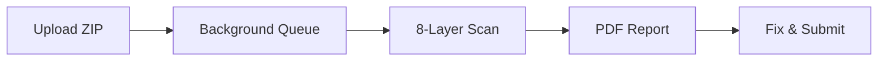

# 🚀 CodeAudit Pro - The Ultimate Code Audit Platform

[](https://opensource.org/licenses/MIT)
[](https://php.net)
[](https://laravel.com)

**CodeAudit Pro** is a comprehensive, multi-platform code auditing solution that automatically scans your projects against Envato requirements and global coding standards. Save hours of manual review and ensure first-time acceptance.

---

## 📋 **Table of Contents**
- [✨ Key Features](#-key-features)
- [🔍 Supported Platforms](#-supported-platforms)
- [🛠️ How It Works](#️-how-it-works)
- [📊 What We Scan](#-what-we-scan)
- [💼 Business Opportunity](#-business-opportunity)
- [📦 Package Includes](#-package-includes)
- [💻 Technology Stack](#-technology-stack)
- [📞 Contact & Support](#-contact--support)

---

## ✨ **Key Features**

✅ **Multi-Platform Support** – Scan Laravel, WordPress, Flutter, and React projects  
✅ **Envato Requirements Check** – Catch issues before submission  
✅ **8 Comprehensive Scan Types** – Security, Quality, Architecture, and more  
✅ **PDF Reports** – Professional reports with exact file + line number  
✅ **SaaS Ready** – Complete subscription system with Stripe integration  
✅ **Self-Hostable** – Full source code included  
✅ **RTL Support** – Full Arabic language support  
✅ **Dark/Light Mode** – Modern, accessible interface  

---

## 🔍 **Supported Platforms**

### **🟣 Laravel Projects**
- Full Laravel application scanning
- Controllers, Models, Services, Policies
- Blade templates & Localization

### **🔵 WordPress Themes & Plugins**
- ThemeForest requirements check
- Plugin headers & readme.txt validation
- Security & best practices

### **🟢 Flutter SDK**
- Dart files analysis
- pubspec.yaml validation
- Null safety & performance checks

### **⚛️ React/JavaScript**
- package.json security audit
- JSX/TSX component analysis
- Hooks rules & best practices

---

## 🛠️ **How It Works**



1. **Upload** your project as a ZIP file
2. **Background processing** (queue system – no waiting)
3. **8-layer scan** against Envato + global standards
4. **Detailed PDF report** with exact file + line numbers
5. **Fix and submit** with 100% confidence

---

## 📊 **What We Scan**

| Scan Type | What It Detects |
|-----------|-----------------|
| **Security** | XSS, CSRF, SQL Injection, dangerous functions |
| **Envato Requirements** | External CDN, missing README, prohibited code |
| **Code Quality** | PSR-12, camelCase, FQCN, dead code |
| **Architecture** | Controller size (>250 lines), missing Policies |
| **Localization** | Untranslated text, RTL support |
| **Database** | Foreign keys, raw SQL, InnoDB |
| **JavaScript** | console.log, eval(), XSS risks |
| **Assets** | External CDN, Alt tags, unnecessary files |

---

## 💼 **Business Opportunity**

CodeAudit Pro isn't just a scanner – it's a **complete SaaS platform** ready for you to:

### **💰 Make Money**
- Sell monthly subscriptions ($9.99 - $19.99)
- Offer team packages for agencies
- White-label for your clients

### **📈 Scale Your Business**
- Built-in Stripe integration
- User management dashboard
- Plan & subscription system
- Analytics & reporting

### **🔮 Roadmap**
- **Q2 2025**: WordPress Plugin/Theme Scanner
- **Q3 2025**: Flutter SDK Support
- **Q4 2025**: AI-Powered Fix Suggestions

---

## 📦 **Package Includes**

```
codeaudit-pro/
├── app/
│   ├── Console/
│   │   └── Commands/          # Cleanup & verify commands
│   ├── Http/
│   │   ├── Controllers/       # Admin & User controllers
│   │   └── Middleware/        # Auth, subscription, locale
│   ├── Jobs/                   # Queue jobs for processing
│   ├── Models/                 # Audit, Plan, Subscription
│   ├── Policies/               # Authorization policies
│   └── Services/               # Business logic layer
│       └── Audit/
│           ├── Analyzers/      # 8 platform analyzers
│           └── Contracts/      # Analyzer interface
├── plugins/                     # Extendable plugin system
├── resources/
│   ├── views/                   # Blade templates
│   └── lang/                    # Multi-language support
├── database/
│   ├── migrations/              # Database schema
│   └── seeders/                 # Default data
├── docs/                         # Complete documentation
│   ├── installation.md
│   ├── user-guide.md
│   └── developer-guide.md
└── README.md
```

**Includes:**
- ✅ Complete source code
- ✅ Full database schema
- ✅ Installation guide with screenshots
- ✅ Video walkthroughs
- ✅ User manual
- ✅ Developer documentation
- ✅ 6 months free updates
- ✅ 3 months technical support

---

## 💻 **Technology Stack**

| Component | Technology |
|-----------|------------|
| **Backend** | Laravel 11.x, PHP 8.2+ |
| **Frontend** | TailwindCSS, Alpine.js, ApexCharts |
| **Database** | MySQL 8.0+ / PostgreSQL / SQLite |
| **Queue** | Redis / Database Queue |
| **Storage** | Local / AWS S3 |
| **Payments** | Stripe |
| **PDF** | DomPDF |
| **Auth** | Laravel Breeze + Socialite |

---

## 📞 **Contact & Support**

📧 **Email:** aboutsystem2@gmail.com  
🌐 **Website:** [https://codeaudit.my-logos.com](https://codeaudit.my-logos.com)  
📚 **Documentation:** [https://docs.codeaudit.my-logos.com](https://docs.codeaudit.my-logos.com)  
💬 **Live Chat:** Inside your dashboard

### **For Business Inquiries:**
- License inquiries
- Custom development
- Partnership opportunities

📧 **Email:** aboutsystem2@gmail.com

---

## 📝 **License**

This project is available for purchase. For licensing information, please contact:  
📧 **aboutsystem2@gmail.com**

---

## ⭐ **Support Us**

If you find this project valuable, consider:
- ⭐ Starring this repository
- 📢 Sharing with fellow developers
- 💼 Purchasing a license for your business

**Built with ❤️ by developers, for developers**
